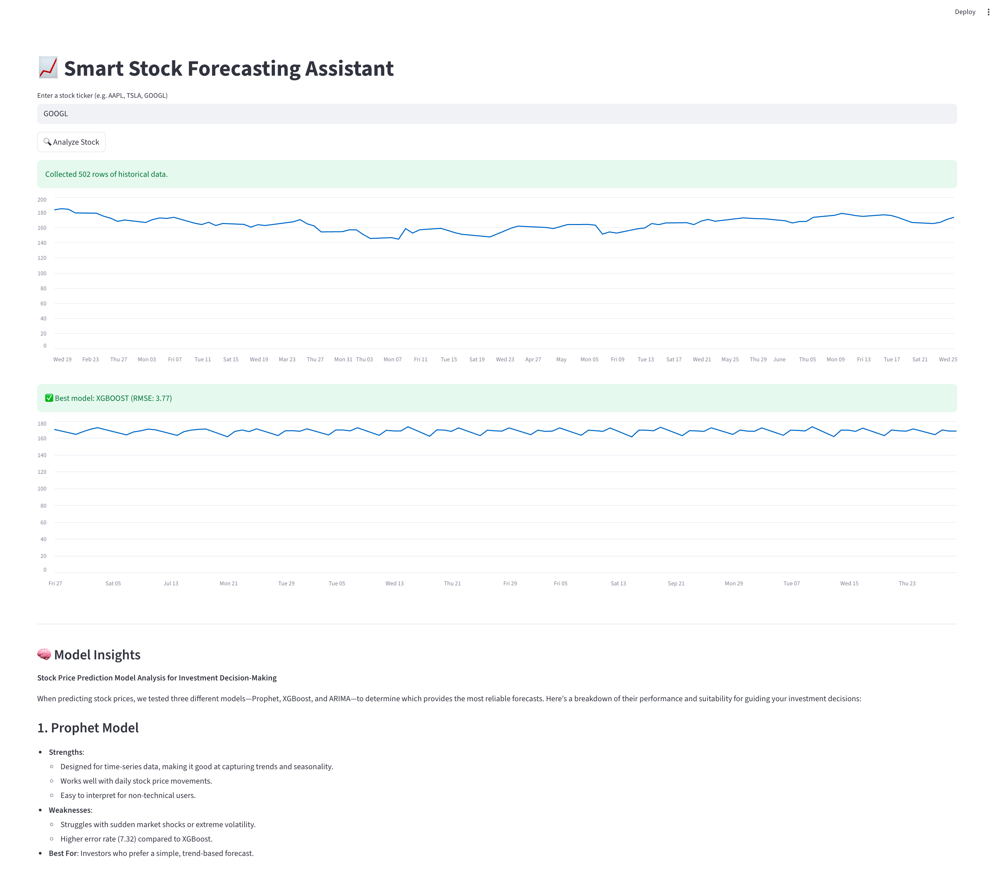
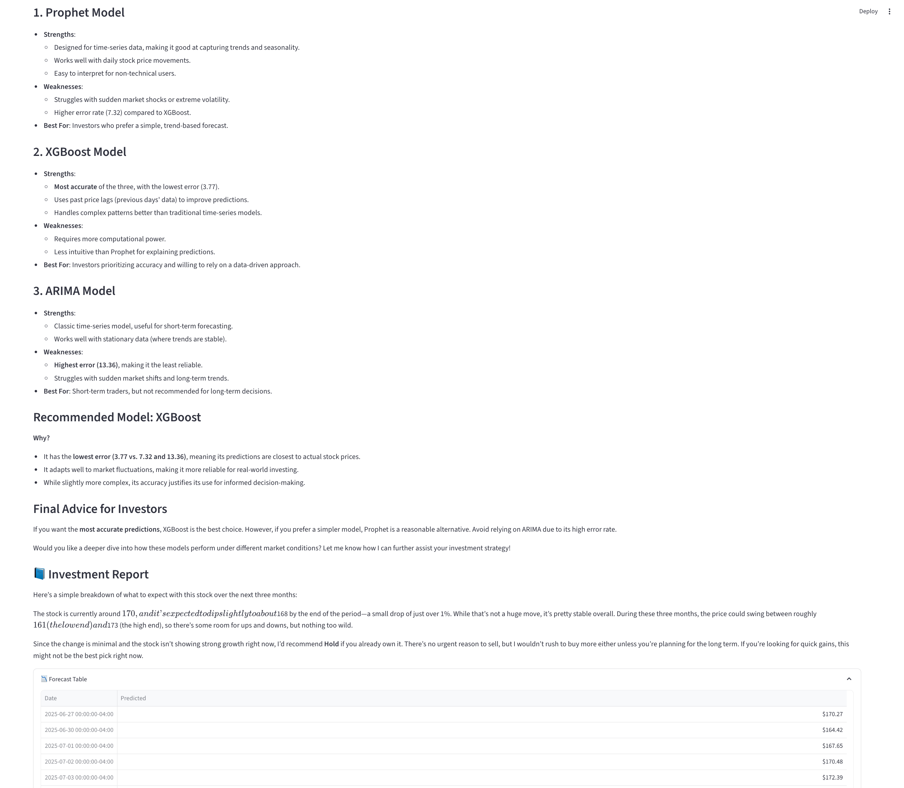

# Preview



---

# AI-Powered Investment Forecasting Assistant

An intelligent, multi-agent system built to help everyday users make smarter investment decisions. This project combines time series forecasting, LLM reasoning, and agentic system design into a single, user-friendly Streamlit app.

---

## 🔍 What It Does

This application acts as a personal investment advisor powered by AI. It analyzes any given stock by:

- 📈 Collecting historical stock data from free APIs
- 🧠 Training multiple forecasting models:
  - `XGBoost`
  - `Prophet` (Meta)
  - `ARIMA`
- ✅ Automatically selecting the best-performing model using RMSE
- 🔮 Predicting future stock prices for the next 90 days
- 💡 Generating natural-language insights with DeepSeek or GPT-based LLMs
- 📘 Producing an easy-to-understand investment report with a clear **Buy / Hold / Sell** recommendation

---

## 🧠 Agentic Architecture

The system follows agentic design principles, where each module is a focused, single-responsibility agent:

| Agent | Role |
|-------|------|
| **DataCollectorAgent** | Collects historical price data |
| **ModelRunnerAgent**   | Preprocesses data, trains 3 models, selects best |
| **PredictorAgent**     | Predicts next 3 months of prices using selected model |
| **InsightAgent**       | Uses an LLM to convert predictions into insights |
| **OutputAgent**        | Generates a human-friendly report to guide decision-making |

---

## 🛠 Tech Stack

- `Python 3.10+`
- `Streamlit` (UI)
- `yfinance`, `pmdarima`, `prophet`, `xgboost`, `scikit-learn`
- `OpenAI` / `DeepSeek` API for LLMs
- `.env` for API key management

---

## 🖥️ How to Run

1. **Clone the repo:**
   ```bash
   git clone https://github.com/DSM2499/AI_Investment_Advisor
   cd AI_Investment_Advisor
   ```
2. Set up virtual environment
   ```bash
   python3 -m venv venv
   source venv/bin/activate  # or venv\Scripts\activate on Windows
   ```
3. Install dependencies
   ```bash
   pip install -r requirements.txt
   ```
4. Set your API Key:
   Create a `.env` file
   ```bash
   OPENAI_API_KEY=sk-...
   ```
5. Launch the app
   ```bash
   streamlit run app.py
   ```

---

## 🎯 Why I Built This
To explore how AI, LLMs, and agentic systems can be used to democratize financial insights — especially for retail investors who don’t have access to tools like Bloomberg or analysts.
   
